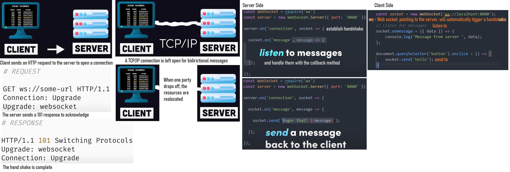
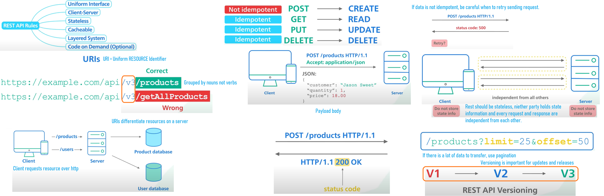
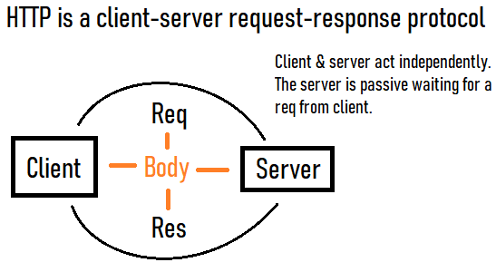
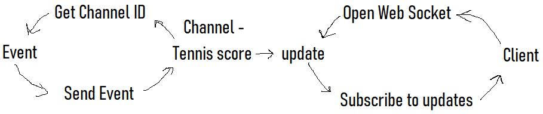
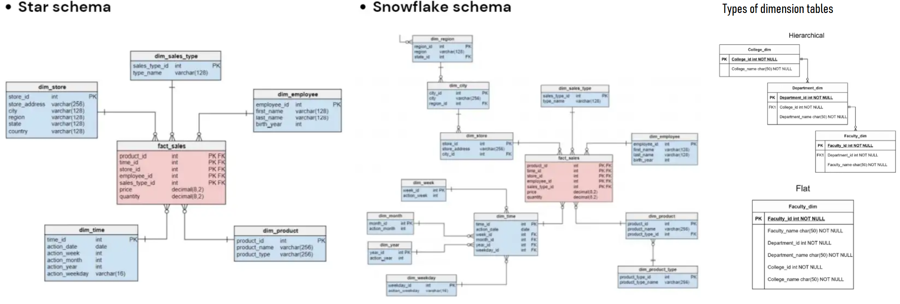

# **Fundamentals of Data Engineering**
Data engineering is a set of operations aimed @ creating interfaces and mechanisms for the flow and access of information. It takes **dedicated specialists** - data engineers - to maintain data so that it remains available and usable by others. DEs setup and operate the org's data infrastructure, preparing it for further analysis. This discipline also integrates specialization around the operation of so called "big data" distributed systems, along with concepts around the extended Hadoop ecosystem, stream processing and computational scale.

DEs collaborate successfully automate cleaning and prepping as much as possible. 

# **Data Engineering Project**
### Ideas
- Python data generator class
- Event driven API
    - Chat, alerts
    - Notification
    - IoT generates 1 sec random data [web sockets]
     

- Real-time API streaming high volumes of data REST
- Just because a traditional REST API can deliver data in real-time, does not make it a real-time API. I.e. The basic idea of real-time API is to **react or respond to events** as they happen:
    - Pub/Sub: messaging pattern
    - Streaming: Consumer pattern
    - Push: producer pattern
    - Event-driven: architectural pattern
- Event-driven APIs follow an **async communication model** consisting of the following main components:
    - Event producer - push data to channels whenever event takes place
    - Channels - they push data received from event producer to event consumer
    - Event consumer - subscribe to channels and consume data
    - 1 Million events per second challenges in async processing: Data loss, processing latencies, out of order and duplicate records, intermittent processing failure
- Initiated = from the event producer's side    
- Subscription models:
    - Server initiated (**push based**) - Football app: uses data stream to deliver real-time updates to end users upon a relevant action. If a goal is scored, the event is pushed to a channel, which then pushes the event to the clients when they are connected. Server initiated approach, consumer connects and producer is responsible for pushing data to consumers on event occurrence. Protocol: Web Sockets
    - Client initiated (**pull based**) - Client-initiated models only access data when they are online and don't care what happens when they are disconnected. The complexity of the producer is reduced as the server side doesn't need to be stateful. In a client initiated model, **the consumer is responsible** for connecting and subscribing to an event-driven data stream. From a producer's perspective, clients decide when to subscribe, otherwise no work is done. Web sockets are most common initiated protocol.
- In an event driven arch, producers and consumers are decoupled. Components perform their tasks independently and are unaware of each other. This separation of concerns allows for a more reliably scalable real-time system, and can prevent potential issues with one component effecting the others.
- Consumer pools
    - Alert system (logic)
    - Doctor monitoring (live/historical)
    - Patient (live/historical)
- Web sockets provide full duplex, low overhead, high data count communication channel over single TCP connection. **Socket IO** is built on top of web socket.
- REST - The consumer is always **responsible for maintaining state** and always has to trigger requests to get updates. 
        

- Event driven system - the producer is **responsible for maintaining state** and pushing updates to consumers.    

# Http 

Request has the following methods: 
> PUT: update data
> POST: when we want to upload to server/DB
> GET: read data
> DELETE: remove data

Request has metadata:
> Headers: place to put authentication for authorization. Host name, who to contact

Response has metadata:
> Status code: 200, 400, 500

Body:
> JSON Data, Payload body from client. Response body from server. 

# WebSockets
## SocketIO
# WebHooks
# GraphQL
# gRPC

Patient -> client initiated REST API --> Internal Repository --> server initiated Web Sockets -> Event View dashboard
<ol style=color:cyan>
    <li>Doc makes request.</li>
    <li>Black box connects Doc to Kafka</li>
    <li>Does consumer group duplicate partitions when reconfiguring?</li>
</ol>

<ol style=color:cyan>
    <li>Measure reception quality by counting distance between HR pulses timestamp being received</li>
    <li>Connection churn</li>
    <li>Back pressure - Build up of items waiting to be processed</li>
    <li>Message Fan out</li>
</ol>

Doc --> News feed + simple follower mechanism --> Doc

# **Designing a system**
1. No way of knowing how many client devices could subscribe to updates at any given moment
2. Clients can connect and disconnect at any moment
3. A 1:1 Pub/Sub relationship connection with each  client device is not scalable. Publish one message on an event and distribute to all connected devices using message broker (Kafka)

4. Fault Tolerance: if one Pub fails, backup Pub resumes server initiated messaging
5. Streaming protocols such as Kafka have less overhead then webhooks using http, providing ordering and integrity guarantees. Idempotence and data sharding.

# **Event-driven processing**
Put incoming events into in-memory storage and keep them for as long as they are useful for real-time purposes. After a few days, then discard.     
Store high priority patients HR's incoming event into in-memory for 7 days to quickly display data on critical alert
Keep the last time stamp and compare with the new one. If threshold delay exceeded, something happened and alert
Data durability: Data in-memory can be used to reconcile. If DB transactions where missed, alert

https://www.redhat.com/architect/in-memory-data-grids       
https://shahirdaya.medium.com/the-role-of-in-memory-data-grids-in-event-driven-streaming-data-architectures-b32f976afc16        
https://hazelcast.com/glossary/event-driven-architecture/

**Static Data** = CSV, Parquet = Processed in batches = Map Reduce, Spark       
**Streaming Data** = Kafka, Kinesis = Processed as events arrive = Flink, Samza, Spark Streaming

### **Data Loss**
Kafka Stand by cluster = high cost but safe
Data Loss @ publish time = multiple partitions increase scalability. Each partition is served by a group of servers called **brokers** where one of these is elected leader. Publishing into a partition = sending data to leader broker. Either wait for the leader to ack or for the follower brokers to ack as well. With critical data, makes sense to wait for all ack. At large scale, this has cost of waiting for multiple writes and beyond. If a broker becomes unavailable while waiting for ack will cause slow down and back pressure and unavailability. If data is written, ack not sent and leader election happens, data will be lost. This is called **unclean broker leader election**. Solution = Kafka wrapper choosing to which non-keyed partition to write to. Also publisher writes into in-memory queue and async publishes into Kafka.       
Kafka adds processing delay/log     
Changing consumers rebalances partitions = side effects. Solution = If processing is stateful, for ex. consumers may have to pause processing, then take an in-memory state and checkpoint that along with the Kafka offset, up to which they have processed. After partitions are rebalanced, the consumers reload the checlpoint data and resume. 
During rebalancing/missed ack, duplicate data might be published into partition, then consumed. Idempotence/dealing with duplicate measures.
Measure records per second --> add and remove nodes -> partition rebalancing = potential data loss
Out of order and duplicate records are going to happen in a distributed system
Amazon simple queue service (SQS) can hold failed messages for later processing
Ask: which processing platform benefits which use case.

External facing query engines often handle much larger concurrency loads then internal facing systems. Putting tight limits on queries that external users can run to limit the infrastructure impact of any single user. Data being queried by many customers from a single table imposes security issues. 

## Evaluating source systems: key engineering considerations
1) For stateful systems e.g. tracking customer account info, is data provided as periodic snapshots or update events from CDC?
2) At what rate is data generated? Events/s GB/s
3) Will some data arrive late, possibly later then other messages produces simultaneously?
4) What is the schema of the ingested data?
5) Need to join across several tables or even systems to get a complete picture of the data?
6) What is the logic for how changes are performed and how are these tracked in the source DB?
7) Will reading from a data source impact its performance? 
8) Are data quality checks in place to check for late or missing data?
9) What level of consistency is expected?
10) How often do errors occur?
11) Will data contain duplicates?
12) If schema changes, how is this communicated with down stream stakeholders?
13) How frequent should data be refreshed?

## Evaluating storage systems: key engineering considerations
1) Is the storage compatible with the architecture's required R/W speeds?
2) Are you utilizing the storage system optimally?
3) Capturing metadata about schema evolution, data flows... data about the data
4) Will the storage system handle anticipated future scale?
5) Is this a pure storage solution (object storage) or does it support complex query patterns, ex DWH?
6) Is the schema fixed or flexible?
7) Data access frequency: **hot data** retrieved many times/day or /sec? **Lukewarm** access/week /month?

## Evaluating ingestion systems: key engineering considerations
1) Source systems might randomly become unresponsive, provide data of poor quality, service / data flow stop working, insufficient data for storage, processing and serving.
2) Can I reuse the data rather then create multiple versions of the same dataset?
3) Are the systems ingesting this data reliably and is the data available when needed? (long processing overhead)
4) If the data is from a streaming source, does it need to be transformed before reaching destination? Can transformation be done in-flight (within the stream) ?

## Stream
1) Can downstream storage systems handle the rate of real time data flow?
2) Do we need real time millisecond ingestion of **microbatch** accumulating and processing data every minute?
3) Are streaming pipelines redundant and reliable if infrastructure fails?
4) Should I use manged services (AWS|GC) or open source (Kafka|Spark)?
5) If I am deploying ML, what benefits do I have with online predictions and continuous training?

## Pull vs Push
In **push** model of data ingestion, the source writes data to the target. In **pull** model, data is retrieved from source. In traditional ETL **pull ingestion model**, the ingestion system queries a current source table snapshot on a fixed schedule. CDC's once common method triggers a message every time a  row is changed. This message is **pushed** to **queue**, where the ingestion system picks it up. Another common CDC method uses binary logs which record every commit to the DB. The DB **pushes** to its **logs**. the ingestion system reads the logs but doesn't interact with the system otherwise. This adds little to no additional load to the DB. In CDC **timestamp** pull pattern, an ingestion system queries the source database and pulls the rows that have changed since the previous update. 

## Data Engineering life cycle
Is a subset of the whole data life cycle across its entire life-span. 
Stages of a project:
1) Generation: Source system
2) Storage: data access frequency, storage system
3) Ingestion: Batch vs streaming, push vs pull
4) Transformation: Storing | saving data

## Security
Users, Identity Access management, roles, polices, groups, network security, password policy, encryption. Timing providing data access to exactly the people and systems that need to access it and only for the duration necessary to perform their work. Encryption, tokenization, data masking, obfuscation, robust access control.

## Data Governance
Quality, integrity, security, usability of data collected. 

### Difference between Database and Data Warehouse
- DWH primary focus goes on using aggregation functions, performing calculations and selecting subsets in data for processing. Databases are related to data manipulation, crud operations and more. Speed and efficiency play an important role in working with either.
- Dimensional modeling uses the concepts of **facts (measures)** and **dimensions (context)**. Facts are typically numeric values that can be aggregated and dimensions are groups of hierarchies and descriptors that define that facts. 
- Identify the Fact (measurement) = timestamp, product, register#, store#, elements of dimensions, numeric and quantifiable, measurement, metric. Fact table is a primary table in dimension modelling, and contains foreign key to dimension table.
- Identify the Dimensions (context) = store sales, inventory, claims, employee, teacher, goods. Contain descriptive characteristics of a fact with help of attributes, are de-normalized. Can contain one or more hierarchical relationship 
- Build the schema

### Rules for Dimensional Modelling

1) Load atomic data into dimensional structures.
2) Build dimensional models around business processes.
3) Need to ensure that every fact table has an associated date dimension table.
4) Ensure that all facts in a single fact table are at the same grain or level of detail.
5) It’s essential to store report labels and filter domain values in dimension tables
6) Need to ensure that dimension tables use a surrogate key
7) Continuously balance requirements and realities to deliver business solution to support their decision-making     

### Benefits of Dimensional Modeling
1) Standardization of dimensions allows easy reporting across areas of the business.
2) Dimension tables store the history of the dimensional information.
3) It allows to introduce entirely new dimension without major disruptions to the fact table.
4) Dimensional also to store data in such a fashion that it is easier to retrieve the information from the data once the data is stored in the database.
5) Compared to the normalized model dimensional table are easier to understand.
6) Information is grouped into clear and simple business categories.
7) The dimensional model is very understandable by the business. This model is based on business terms, so that the business knows what each fact, dimension, or attribute means.
8) Dimensional models are de-normalized and optimized for fast data querying. Many relational database platforms recognize this model and optimize query execution plans to aid in performance.
9) Dimensional modelling in data warehouse creates a schema which is optimized for high performance. It means fewer joins and helps with minimized data redundancy.
10) The dimensional model also helps to boost query performance. It is more denormalized therefore it is optimized for querying.
11) Dimensional models can comfortably accommodate change. Dimension tables can have more columns added to them without affecting existing business intelligence applications using these tables.